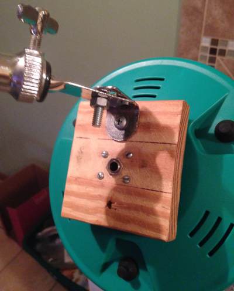

***
For years now, I have dreamed of building a hardware MIDI device. I initially got the inspiration after learning that the Rock Band drum set has MIDI capabilities. So, I bought a used one at Goodwill and proceeded to rip it apart. Upon examining the insides of the pads, I was pleasantly surprised that these mysterious devices were nothing more than a piezo sensor glued to a rubber circle. I'd learned about piezos when I was in school for Audio Engineering. My teacher (no, I'm not making this [person](https://en.wikipedia.org/wiki/Biff_Blumfumgagnge) up), Biff U. Blumfumgagnge, came riding into class one day with his MIDI equipped bicycle.
  

<small>
*not as cool as Biff's MIDI bike, but just as functional*
</small>

There were piezos all over the thing and he explained how they worked and I've never been the same. At the moment, it was clear that creating a MIDI controller is incredibly simple and absolutely in reach of anyone who dreamt of doing it. Inspired, I took my ripped up Rock Band drum set pads, soldered an input jack to its piezo, and screwed the pad and jack to a block of wood. After assembly, I grabbed my Arduino Uno and came up with a basic sketch for testing purposes (check it out [here](https://github.com/brandonwkipp/raspbeat)). After creating a makeshift box out of some old cardboard and some quick soldering, it was up and running. I hooked everything up and tapped the pad with a drum stick and voila, MIDI. I felt like a wizard. It was very rewarding to combine my love of music with my new love of code. More updates soon.
