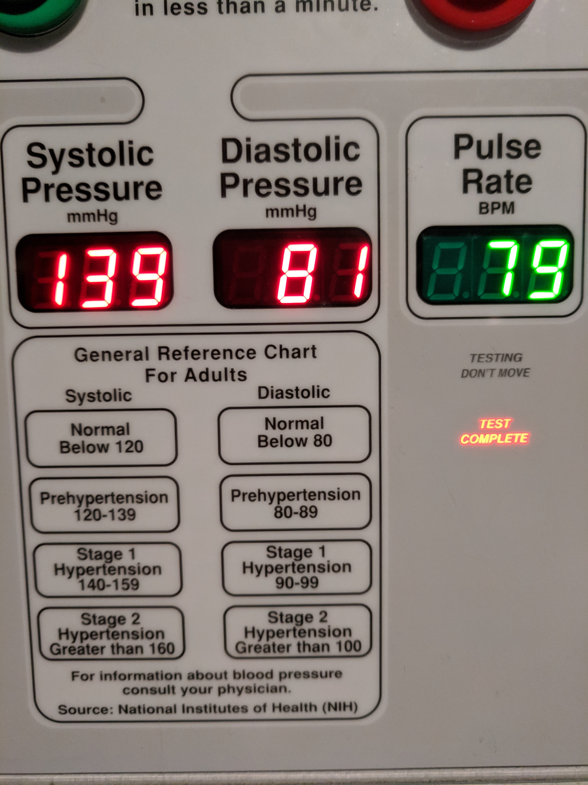

***

  

    
    

      <small>*Taken at 09:53 on 2019, December 4th*</small>
    

  

  

    
    

      <small>*Taken at 15:35 on 2019, December 4th*</small>
    

  

 
 

Well, that's not great; although, not surprising since I'm a relatively sedentary person. I'm pretty stressed
these days with the amount of things on my plate. My body is pretty clearly telling me to walk more. The exercise
I have been doing seems to be too much; now that I'm not at the gym anymore, there's nothing from stopping me from
working too hard. For a while, I was doing rucking with around 20 lbs. in a backpack on my back. After doing that
daily for about month straight, my back started hurting. I thought about dropping some of the weight, but I just
stopped doing it out of fear of hurting myself more. More recently I've been doing a lot of arm lifting and I think
even that hurt me. I think it caused some pretty excruciating back/shoulder pain I've been dealing with for the last
week or so. All that seems left is to just walk. Or not go so hard.
